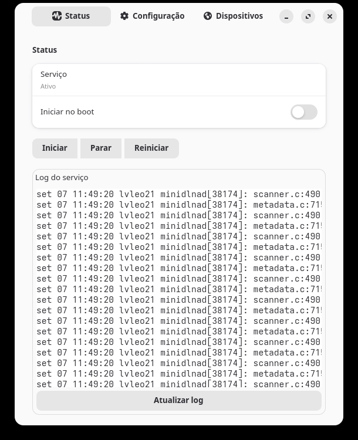
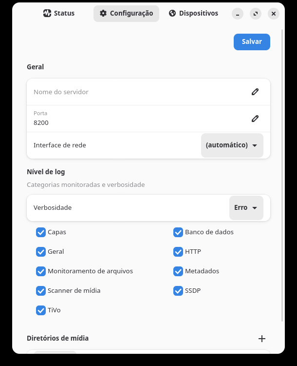
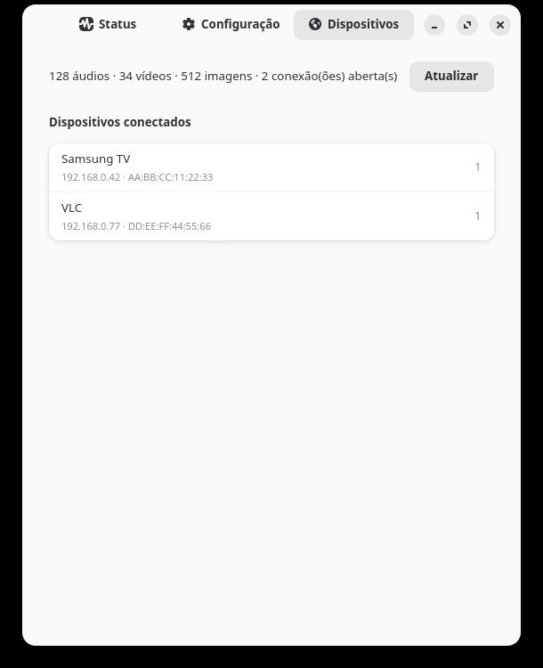

# MiniDLNA Manager

Aplicativo desktop (GTK4 + libadwaita) para gerenciar o serviço MiniDLNA no
Linux. A UI nunca roda com privilégio elevado — toda operação que precisa de
root (systemctl, escrita em `/etc/minidlna.conf`, instalação do pacote) passa
por um helper dedicado, autorizado via Polkit.

## Capturas de tela

| Status | Configuração | Dispositivos |
| --- | --- | --- |
|  |  |  |

## Funcionalidades

- Detecta se o MiniDLNA está instalado e oferece instalar direto pela
  interface (apt/dnf/pacman/zypper, com detecção automática do gerenciador)
- Iniciar, parar, reiniciar o serviço e alternar o início automático no boot
- Ver as últimas linhas de log do serviço
- Editar `minidlna.conf` por um formulário estruturado — nome do servidor,
  porta, interface de rede, nível de log (por categoria) e diretórios de
  mídia (com seletor nativo de pasta) — com validação antes de qualquer
  escrita e opção de reiniciar o serviço logo após salvar
- Aba de dispositivos conectados, lida direto da própria página de status do
  `minidlnad`

## Instalação

### Arch / Manjaro

Baixe o `.pkg.tar.zst` pronto na [página de releases](https://github.com/lvleo21/minidlna-manager/releases/latest) e instale:

```bash
sudo pacman -U minidlna-manager-*.pkg.tar.zst
```

Ou builde a partir do código-fonte:

```bash
cd packaging/arch
makepkg -si
```

Qualquer um dos dois instala o app, o helper privilegiado
(`/usr/lib/minidlna-manager/helper`) e a regra Polkit
(`/usr/share/polkit-1/actions/`). O MiniDLNA em si não é uma dependência
obrigatória do pacote — se estiver ausente, o próprio app oferece instalá-lo
na primeira execução.

Depois de instalado, abra pelo menu de aplicativos ou rode `minidlna-manager`.

### Debian / Ubuntu / Mint

Baixe o `.deb` pronto na [página de releases](https://github.com/lvleo21/minidlna-manager/releases/latest)
e instale:

```bash
sudo apt install ./minidlna-manager_*_all.deb
```

Ou builde a partir do código-fonte:

```bash
cd packaging/deb
./build-deb.sh
sudo apt install ./dist/minidlna-manager_*_all.deb
```

Requer GTK 4.6 e libadwaita 1.1 ou mais novos — ou seja, Ubuntu 22.04+,
Debian 12+ e Mint 21+. O pacote declara esses pisos, então o apt recusa um
sistema mais antigo em vez de instalar algo que não abre.

O `build-deb.sh` usa só `dpkg-deb`, então também roda fora do Debian (no Arch,
`pacman -S dpkg`). Ver `packaging/deb/README.md` para o layout do pacote e as
dependências.

### Outras distros

Ainda não há Flatpak pronto — ver `packaging/flatpak/README.md`. Enquanto
isso, dá para rodar direto do código-fonte (ver "Desenvolvimento" abaixo)
desde que o helper e a regra Polkit sejam instalados manualmente:

```bash
sudo install -Dm755 helper/minidlna_manager_helper.py /usr/lib/minidlna-manager/helper
sudo install -Dm644 policy/com.lvleo21.minidlnamanager.policy \
  /usr/share/polkit-1/actions/com.lvleo21.minidlnamanager.policy
```

## Desenvolvimento

```bash
make install   # instala dependências (modo editável + dev)
make test      # roda a suíte de testes
make lint      # roda o linter (ruff)
python -m ui.app   # roda o app a partir do código-fonte
```

Requer PyGObject com GTK4 e libadwaita instalados no sistema (não é possível
instalar via pip puro — normalmente vêm do gerenciador de pacotes da distro,
ex.: `python-gobject`, `gtk4`, `libadwaita` no Arch).

A UI é escrita contra o libadwaita moderno, mas roda a partir do 1.1: os
widgets introduzidos depois disso (`Adw.SwitchRow`, `Adw.ToolbarView`,
`Adw.Banner`, `Adw.EntryRow`, `Gtk.FileDialog`) passam por `ui/compat.py`, que
usa o widget nativo quando ele existe e um equivalente montado com primitivas
do 1.0 quando não. Ao usar um widget novo, adicione o fallback lá — a CI abre a
janela em Ubuntu 22.04 e falha se ele não existir.
